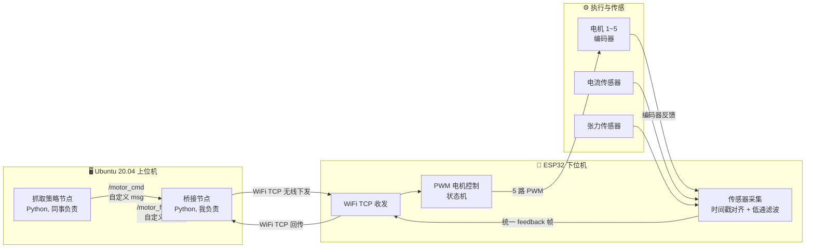
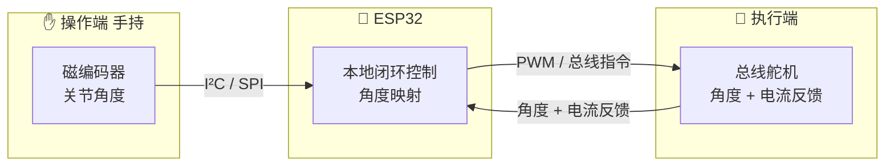
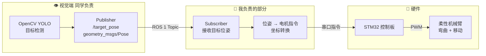
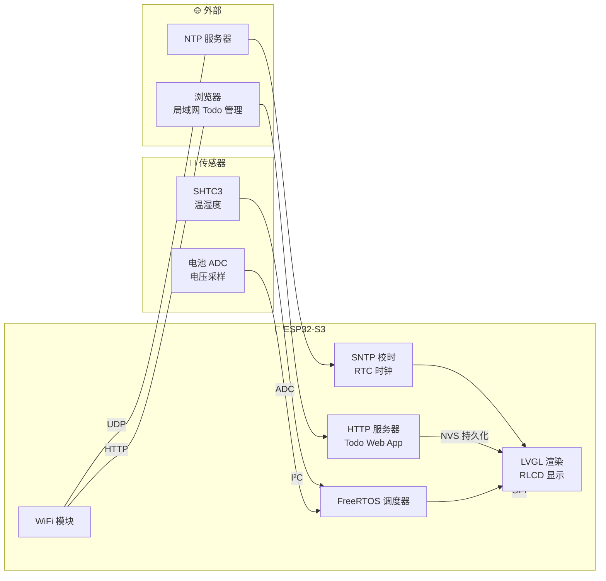

# Yu Wang — 机器人硬件工程师 | Portfolio

> 📍 广东·深圳 | 🎓 香港大学 ARC Lab (MPhil 2026) | ✉️ ywang812@foxmail.com

---

## 关于我

我在香港大学 ARC Lab 做了三年半机器人硬件原型开发，核心能力是从 **CAD 结构设计 → 3D 打印 → 嵌入式控制 → 传感器集成 → 上电调试** 的全链路机电系统搭建。同时有 ROS/ROS 2 的实际对接经验，能起到硬件和软件之间的桥梁作用。

---

## 项目

### 1. Lasso Gripper — 绳驱自适应夹爪（IEEE ROBIO 2025）

**角色**：硬件全链路（结构设计、3D 打印、嵌入式控制、WiFi 通信、ROS 2 桥接）

**做了什么**：
- SolidWorks 完成整体结构建模（绳索投射机构、回收机构、5 电机腱路径布局），FDM 3D 打印迭代 4+ 版
- ESP32 主控：5 路 PWM 协同调速、编码器位置/速度反馈、电流传感器堵转检测、张力传感器抓取力反馈
- ESP32 固件实现多传感器时间戳对齐 + 低通滤波，统一打包 feedback 帧
- WiFi TCP 无线通信（无有线串口，解决机械臂运动中绕线问题）
- 写 ROS 2 Humble 桥接节点：订阅 `/motor_cmd` → TCP 下发 ESP32 → 回传 publish `/motor_feedback`
- 独立排查腱路径摩擦力问题（理论值 40% → 85%+）：发现 3D 打印表面粗糙度 + 转折角叠加，重新设计路径并加 PTFE 内衬

**亮点**：工作空间比传统夹爪扩大 157%，发表在 IEEE ROBIO 2025

#### 系统架构

---

### 2. 手术器械 — 手持主从遥操作原型

**角色**：硬件全链路（结构设计、3D 打印、ESP32 本地闭环控制、传感器集成），无 ROS

**做了什么**：
- 从机械结构开始：SolidWorks 建模 → 3D 打印外壳和传动件 → 组装
- ESP32 本地闭环控制：操作端磁编码器读关节角度 → 直接映射到执行端总线舵机
- 传感器融合在 MCU 层完成（磁编码器 + 舵机电流反馈），无需上位机
- 证明了"没有 ROS 也能独立完成一套完整的机电闭环系统"

#### 系统架构

---

### 3. MSc 毕设 — 柔性机械臂移动平台抓取

**角色**：ROS 1 接口定义 + subscriber 开发 + STM32 驱动 + 轨迹跟踪，与视觉同学合作

**做了什么**：
- 跟视觉同学约定 ROS 1 topic 接口 —— `/target_pose`，格式 `geometry_msgs/Pose`
- 我写 subscriber 接收目标位姿 → 解析转换 → 串口下发 STM32 → 驱动柔性机械臂做轨迹跟踪
- 两人通过 topic 解耦并行开发，我用 `rqt_graph` 和 `rosbag` 调试验证通信链路
- 这个项目让我体会到：ROS 的核心价值不在于"会用框架"，而在于通过 **接口约定** 让不同模块的人高效协作

#### 系统架构

---

### 4. ESP32 Desktop Display — 桌面信息显示器

**角色**：全栈嵌入式开发（硬件驱动、LVGL UI、Web 服务器、FreeRTOS 多任务）

**做了什么**：
- ESP32-S3 驱动 400×300 反射式液晶屏（RLCD），低功耗、自然光可读
- SHTC3 温湿度采集（小数一位精度），电池电量 ADC 采样
- SNTP 网络校时 + 环形倒计时（当日剩余百分比）
- 内嵌 Web 服务器，局域网浏览器管理 Todo 列表（NVS 持久化）
- I²C / SPI / ADC 底层驱动 + LVGL UI + FreeRTOS 多任务调度

#### 系统架构

---

## 技能

| 领域 | 具体技能 |
|------|---------|
| **结构设计** | SolidWorks 3D 建模、FDM 3D 打印、公差与装配 |
| **嵌入式** | ESP32 (Arduino/ESP-IDF)、STM32、PWM 控制、传感器驱动 |
| **通信** | WiFi TCP/UDP、串口 UART、I²C、SPI |
| **ROS/ROS 2** | Topic 接口定义、pub/sub 节点、自定义 msg、rqt_graph、rosbag、launch 文件 |
| **编程** | Python（ROS 节点、数据处理）、C++（STM32/ESP32 固件） |
| **调试** | 多传感器时间戳对齐、MCU 层低通滤波、端到端通信链路排查 |
| **其他** | Linux (Ubuntu)、Git、Gazebo 基础仿真 |

---

## 联系我

- 📧 ywang812@foxmail.com

