1. 极壳科技有限公司 | 预研工程师（外骨骼机器人方向）| 20-35k| 1-3年 | 本科
   作为公司预研组的核心成员，你不仅负责将创新的技术构想转化为高性能的原型机，还将深度参与前瞻性技术的探索与验证。我们不希望你只是一个执行者，我们希望你是一个拥有“系统思维”的极客，能够通过硬核工程能力支撑起公司的技术护城河。
    【核心职责】
    1. 原型机快速实现：负责外骨骼机器人核心模组的详细机械设计、打样跟踪及组装调试。
    2. 实验与数据闭环：独立设计并执行关键零部件的寿命、性能测试，通过数据分析输出专业的失效分析报告及改进建议。
    3. 技术路径探索：协助负责人调研前沿材料及新机构方案，进行可行性论证与初版 Demo 验证。
    4.知识资产固化：负责预研过程中的技术文档、专利挖掘及标准化作业流程（SOP）的编写。
    5. 跨部门技术协同：对接供应商及量产部门，确保预研成果的平滑交付。
    (任职要求)
    -背景：硕士及以上学历（特别优秀者放宽至本科），机械工程、机器人、机械电子工程等相关专业，1-3年工作经验。硬核技能：
    -精通 Creo等设计软件，具备精密机构设计经验，对公差配合、材料选型有深刻理解。
    - 动手能力极强：能够亲自调试设备，熟悉 3D打印、快速打样流程。
    - 多面手属性：懂基础的电子电路或具备简单的Python 脚本能力，能独立完成闭环测试。职业素质（核心）：
    - 逻辑严密：能够从混乱的实验现象中剥离出物理本质，并形成书面结论。
    - 抗压与自驱动：自驱动能力强，不需要每一个步骤都被明确指令。规范意识：理解规范化研发的价值。
2. 深圳星际光年科技 | 机器人系统工程师 | 15-25k | 3-5年 | 本科
   技术要点：SDK，ROS，C++，Linux开发/部署经验岗位职责：
    1.主导机器人应用程序核心框架（SDK/FrameWork）设计，实现模块化架构，包括通信中间件、任务调度引擎、状态机管理等。
    2. 负责机器人控制接口、系统监控、后台通信、整机状态管理、日志管理、OTA升级等应用层业务开发。
    3. 基于ROS/ROS2及Linux系统，完成机器人软件系统的集成、部署与优化，保障系统稳定性和实时性。
    4.编写工程技术文档，包括方案设计、设计规范、接口协议、测试报告等。
    5. 与算法、嵌入式、测试团队紧密协作，参与系统联调与问题排查，推动产品落地。任职要求：
    1. 本科及以上学历，计算机、自动化、机器人等相关专业，2年以上机器人产品开发经验。
    2.精通C++编程，熟悉Linux环境下的开发与部署，具备良好的代码规范和文档习惯。
    3. 熟悉ROS/ROS2，有实际机器人项目开发及系统集成经验。
    4. 具备独立思考和问题解决能力，擅于沟通与学习，有团队合作精神。
    5.加分项：
    -有灵巧手、机械臂、足式机器人SDK产品开发经验;-熟悉DDS、ZeroMQ等通信中间件；
    - 有嵌入式边缘计算平台（如NVIDIAJetson、瑞芯微）部署经验。
3. 深圳星际光年科技 | 灵巧手嵌入式软件工程师 | 30-40k | 经验不限 | 硕士
   学历：硕士及以上学历（计算机科学、电子工程、自动化,机器人学、软件工程等相关专业能力）：
    1.嵌入式软件的核心构建者！
    深厚功底:精通 C/C++在嵌入式环境下的开发，深刻理解内存管理、实时性要求、低功耗优化。
    通信专家：熟练掌握并实际应用过多种关键通信协议如 CAN/CAN FD， EtherCAT， SPI， I2C，UART， USB 等，理解其底层机制和优化策略。操作系统驾驭者:拥有在 RTOS(如 FreeRTOS,ZephyrVxWorks,QNX等) 或 Linux 环境下开发复杂嵌入式系统的丰富经验。理解任务调度、中断管理、进程/线程间通信。
    架构思维： 具备设计和实现复杂机器人嵌入式软件架构的能力，理解模块化、可扩展性、可维护性和实时性要求。有从需求分析到架构设计、模块开发、系统集成、测试验证的全流程经验。
    2.灵巧手技术的深度爱好者与驱动者
    对机器人技术，特别是灵巧手、多指操作、传感器融合、实时控制抱有极致的热爱和深入探索的渴望。深刻理解嵌入式软件在实现灵巧手高精度运动控制、多态感知(力/触觉/位置等)、智能抓取策略中的核心作用。渴望将前沿软件技术应用于解决灵巧手开发中的实际挑战(如低延迟、高可靠性、复杂状态机)。
    3.软硬兼修的协同者(加分项)数据手冊
    具备扎实的硬件基础，能阅读和理解原理图、
    熟悉常用传感器(IMU、编码器、力传感器、触觉传感器等)和执行器(电机，特别是直流无刷/步进/伺服)的驱动原理和接口开发。
    拥有基本的硬件调试能力(如使用示波器、逻辑分析仪)定位软硬件协同问题。
    4.学习力与协作力的化身
    强大的自驱力与快速学习能力: 对新技术(如新的通信标准、OS特性、开发工具链)充满好奇，能迅速掌握并应用于项目。卓越的问题解决者： 面对复杂系统级难题，能条理清晰地进行分解、分析、定位并最终解决。
    优秀的团队协作精神:深刻理解嵌入式开发是系统工程善于与机械工程师、控制算法工程师、硬件工程师、测试工程师紧密沟通协作，共同达成目标。具备清晰的技术沟通表达能力。
    回报：
    极具竞争力的薪酬: 提供行业领先水平的薪资，认可你的技术价值。丰厚的早期员工期权:成为公司成长的核心伙伴，共享未来成功果实。
    定义未来的机会:在最前沿的灵巧手领域，亲手构建驱动“智慧之手”的核心大脑，你的代码将直接影响机器人的能力边界。顶尖的技术挑战与平台: 接触最复杂、最有趣的机器人嵌入式开发难题，使用先进工具链，与顶尖技术团队共事。纯粹的工程师文化:扁平化管理，开放透明，技术决策基于专业而非层级。
    持续成长引擎: 提供充足的学习资源、技术分享机会和清晰的职业发展路径。
4. 朗毅科技 | 机器人ROS2开发工程师-应届生可投 | 15-30K | 经验不限 | 硕士
   岗位职责：
    1、核心系统开发：深度参与机器人操作系统的设计与开发，负责从需求分析、架构设计、Modern C++实现到测试验证的全流程工作，打造高可靠、高性能的底层框架。
    2、系统集成与协同：主导或推进机器人软件系统的模块化集成，作为软件枢纽，与感知、规划、控制算法团队及硬件团队紧密协作，确保算法模块、驱动与核心系统无缝融合。
    3、开发者生态建设：参与构建开放的机器人开发者平台与工具链，设计并实现高效、易用的API、SDK及调试工具，降低开发门槛，赋能内外部开发者。
    4、研发效能攻坚：负责建设与优化软件研发效能体系，包括但不限于代码质量规范、持续集成/持续部署（CICD）流水线、自动化测试框架及系统性能析与优化，全面提升团队的交付质量与效率。
    5、技术前瞻与架构演进：跟踪机器人中间件、实时系统（RTOS）、分布式计算等前沿技术，推动系统架构的持续演进与技术选型，解决大规模、高并发机器人应用带来的挑战。
    任职要求:
    1、计算机、电子、通信等相关专业本科及以上学历。
    2、精通ROS 2 架构及其核心机制，熟练掌握rclcpp/rclpy、DDS通信、生命周期节点管理等，并有基于ROS 2进行系统级开发或深度定制的项目经验。
    3、具备出色的 C++编程能力，深入理解面向对象、泛型编程及资源管理，能编写高性能、可维护的系统级代码。
    4、熟悉 Linux 系统编程、多线程/多进程、网络通信（TCP/P），掌握Git、CMake、单元测试等现代软件开发工具链。
    5、拥有机器人、嵌入式系统或工业控制等领域的软件开发与系统集成实战经验。
    6、卓越的工程化思维：代码结构清晰，模块化设计合理，对软件质量、性能与可维护性有极高要求。
    7、强大的系统调试能力：能快速定位并解决复杂的分布式系统问题，如通信延迟、资源竞争、性能瓶颈等。
    8、高效的跨领域协作：具备出色的沟通能力，能精准理解算法与硬件需求，并在软件层面实现高效协同与技术闭环。优先条件（具备以下经验者显著加分）：
    1、深入理解实时操作系统（RTOS）原理，或有相关开发经验。
    2、熟悉分布式系统理论与常见框架，或有高性能通信中间件（如Cyclone DDS、Fast DDS的深度配置与优化）开发经验。
    3、对机器人系统性能分析、可视化（如rqt、Foxglove Studio）有深入研究。
    4、在开源机器人项目（如Autoware、Navigation2）中有代码贡献。
5. 普渡机器人 | 机械结构工程师 | 25-50K | 经验不限 | 本科
    岗位职责：
    1.独立完成多关节产品（人形、机械臂、四足等仿生产品）的结构开发工作，包括预研、方案设计和细节设计；
    2.负责与项目团队协调沟通并完成结构的开发计划;
    3.负责解决在项目开发过程中的各项结构问题，完成各项结构指标，最终完成产品的Qualify;
    4.与ID确定最终CMF方案及ID细节的调整;
    5.根据整机功能提供针对结构功能、性能方面的测试Case和主导相应标准制定。
    任职资格：
    1.全日制统招本科及以上学历，机械结构相关专业，3年以上工作经验;2 对新科技、新产品有好奇心，具备创新精神，具有发散思维意识
    3.熟悉常用静态、动态机械结构形式，有能力迅速根据产品需求确定有优势的技术方案;
    4.有多关节类产品相关研发经验优先;
    5.有塑胶件产品大批量生产经验，并有处理量产产线异常经验
    6.熟知制造加工工艺，塑料/五金模具结构，了解制造环节常见问题以及解决方法；
    7.熟练运用常用的研发设计工具软件；
    8.具有良好的沟通协作能力及良好的团队合作精神，能承受较强的工作压力。
6. 橡鹿机器人 | 机械臂运动控制专家 | 25-35k | 3-5年 | 硕士 |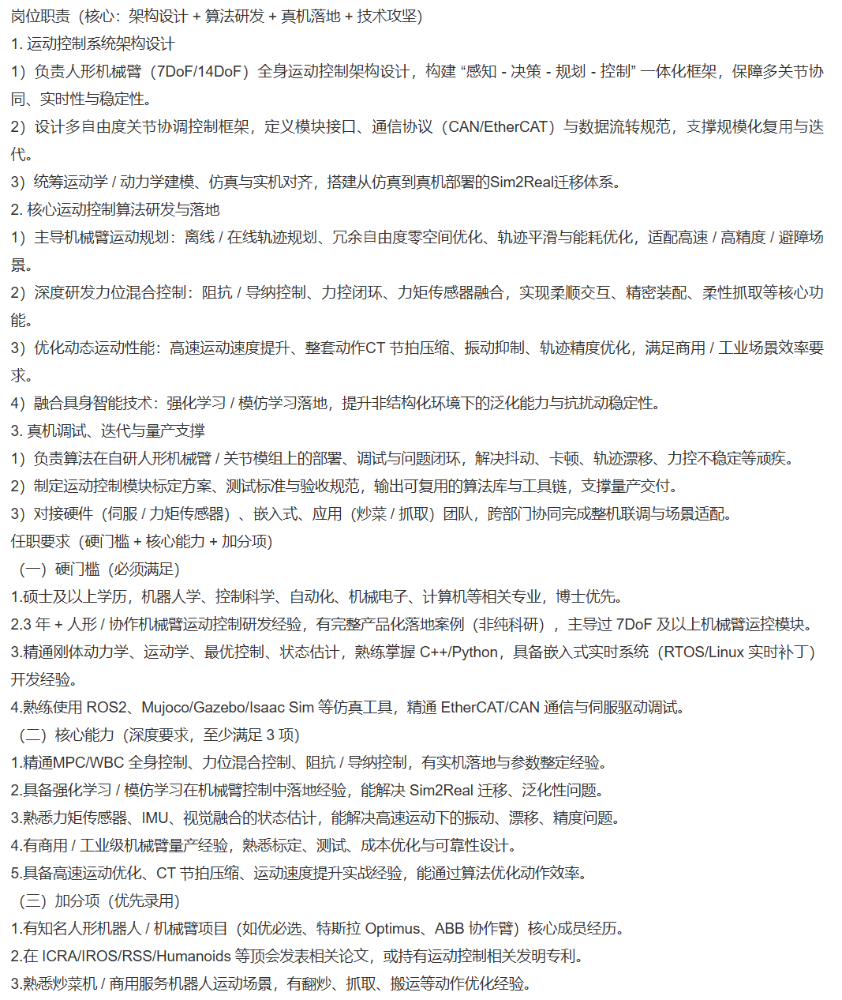
7. 逐际动力 | 机械工程师 | 15-20k | 一年以内 | 硕士 | 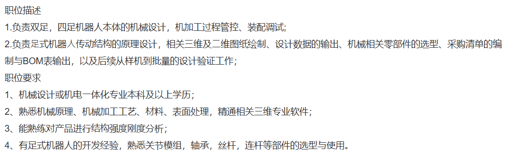
8. 泡泡星球 | 初级机械结构工程师 | 25-40K | 经验不限 | 本科 | 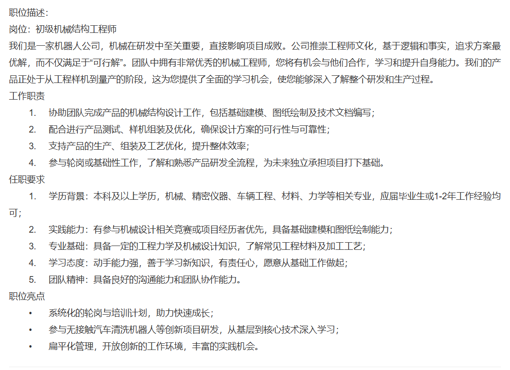
9.  枝序未来科技 | 机器人机械工程师 | 30-35k | 1-3年 | 学历不限 |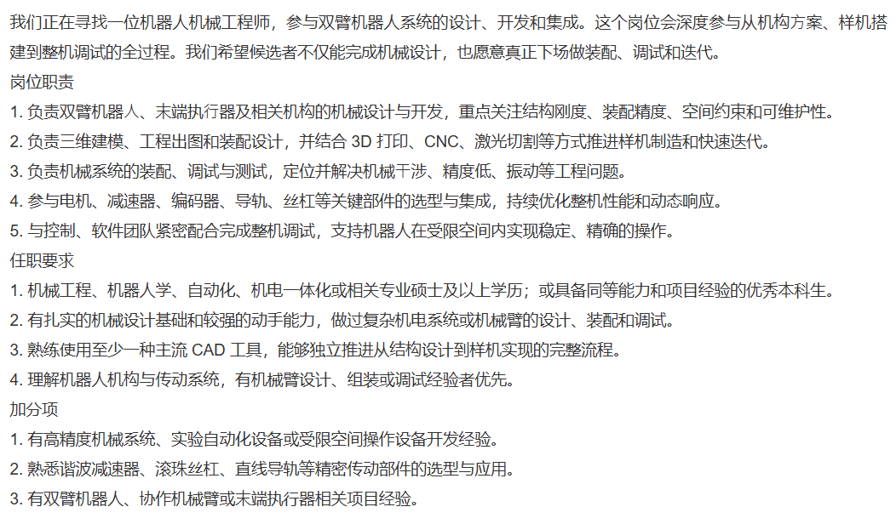
10. 韶音科技 | 嵌入式工程师 | 15-30k | 应届 | 本科 | 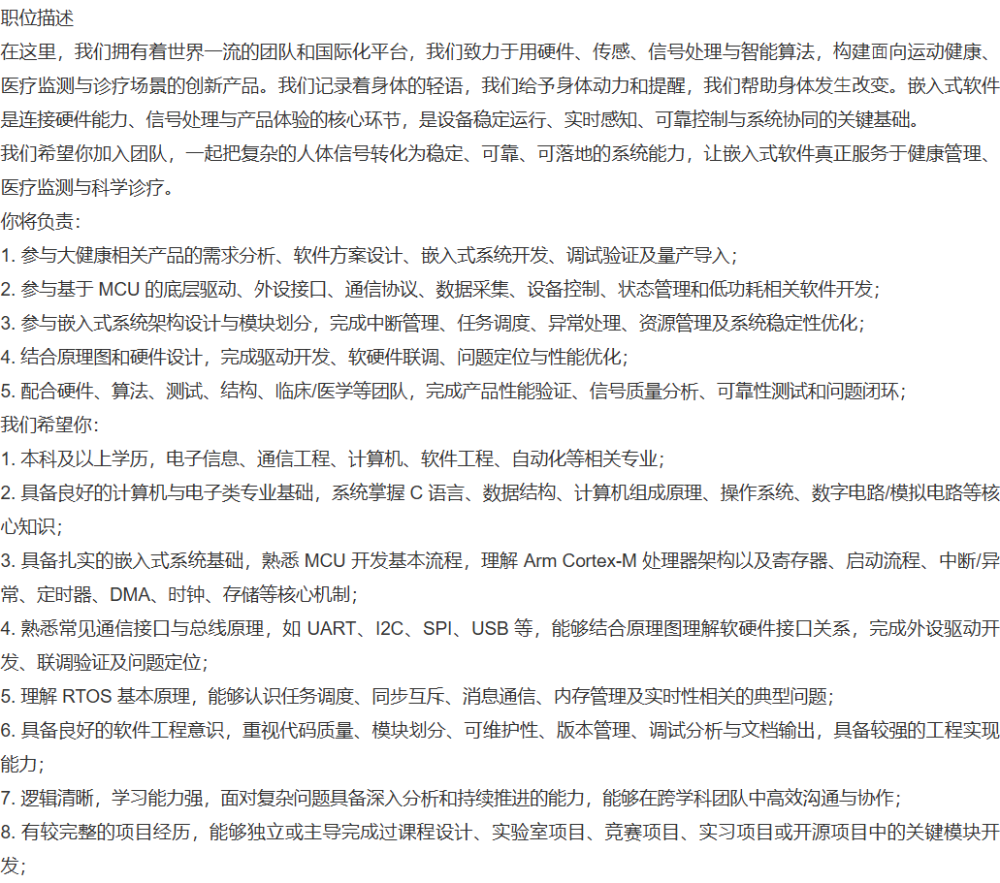
11. 极壳科技 | 机器人算法工程师 | 30-45k | 应届 | 本科 | 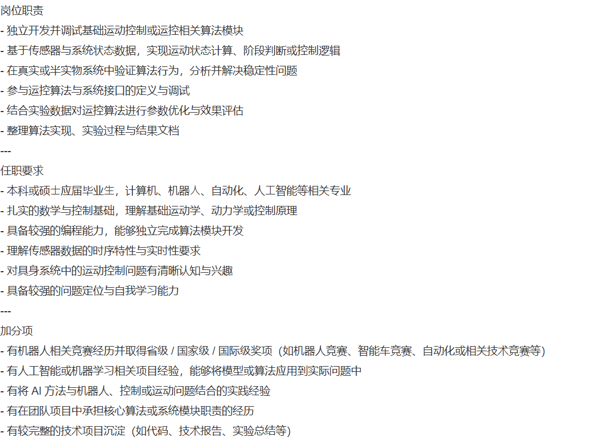
12. 深圳猿声先达科技 | 机械臂软件开发工程师 | 10-15k | 应届 | 本科 | 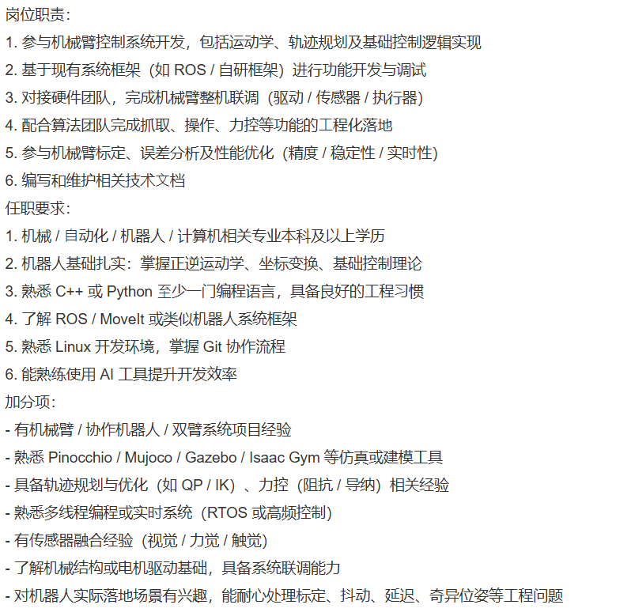
13. 灵心巧手 | 机器人软件工程师（C++） | 20-30k | 应届 | 本科 | 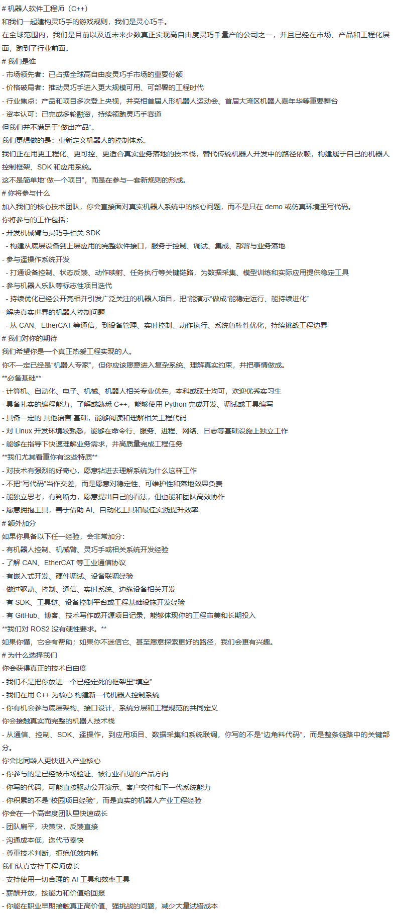
14. 自变量机器人 | 机器人系统工程师（应用） | 18-25K | 应届 | 本科 | 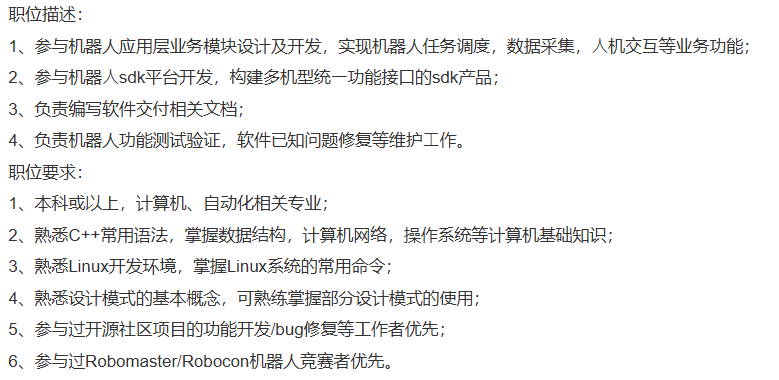
15. 自变量机器人 | 机器人系统工程师（控制） | 18-25K | 应届 | 本科 | 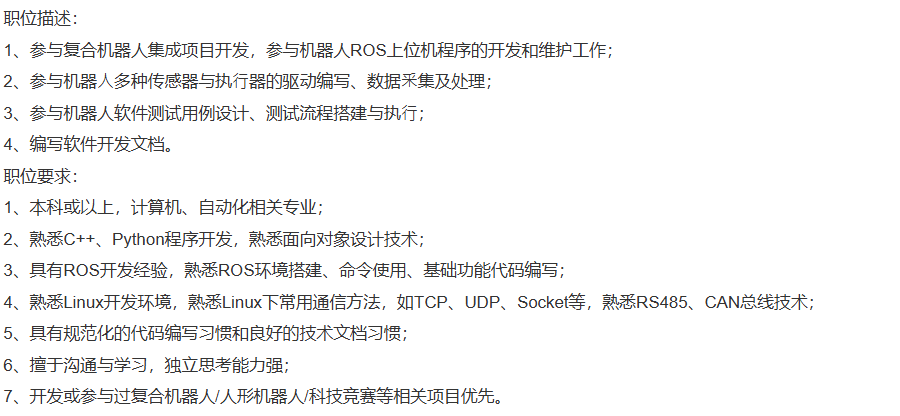
16. 深圳途龄科技 | 机器人嵌入式工程师 | 13-26k | 应届 | 硕士 | 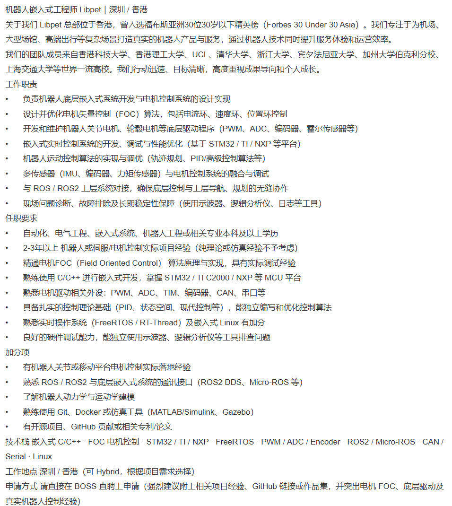
17. 深圳途龄科技 | 机器人工程师 | 15-30k | 应届 | 硕士 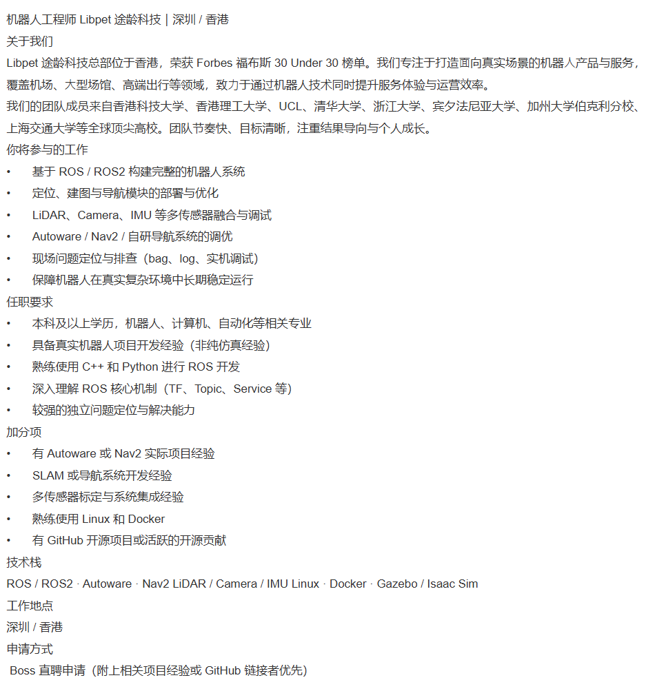
18. 星尘智能 | 机器人算法研究员 | 20-40k | 应届 | 硕士 | 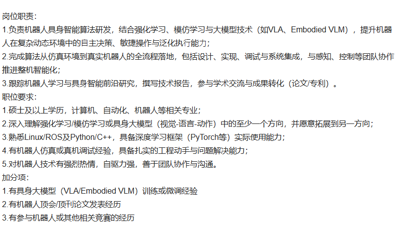 | 注：这家公司硕士应届生的岗位没有跟机械相关的
19. 星尘智能 | 全栈软件工程师 | 20-40k | 应届 | 硕士 | 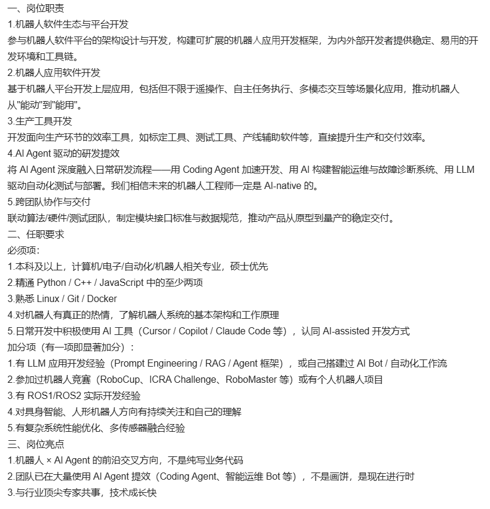
20. 戴盟机器人 | 模型算法工程师 | 30-50k | 应届 | 硕士 | 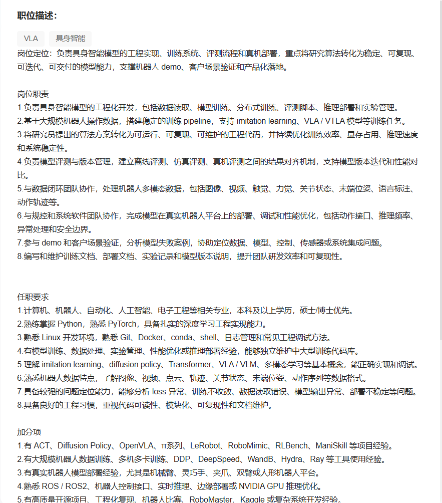 | 注：硕士应届只有这一个岗位
21. 精锋医疗 | 没有硕士应届生岗位
22. 迈瑞医疗 | 没有硕士应届生岗位

职位 （image）
岗位职责 (核心：架构设计+算法研发+真机落地+技术攻坚)
1.运动控制系统架构设计
1）负责人形机械臂（7DoF/14DoF）全身运动控制架构设计，构建“感知-决策-规划-控制”一体化框架，保障多关节协同、实时性与稳定性。
2）设计多自由度关节协调控制框架，定义模块接口、通信协议（CAN/EtherCAT）与数据流转规范，支撑规模化复用与迭代。
3）统筹运动学/动力学建模、仿真与实机对齐，搭建从仿真到真机部署的Sim2Real迁移体系。
2. 核心运动控制算法研发与落地
1）主导机械臂运动规划：离线/在线轨迹规划、冗余自由度零空间优化、轨迹平滑与能耗优化，适配高速/高精度／避障场景。
2）深度研发力位混合控制：阻抗/导纳控制、力控闭环、力矩传感器融合，实现柔顺交互、精密装配、柔性抓取等核心功能。
3）优化动态运动性能：高速运动速度提升、整套动作CT 节拍压缩、振动抑制、轨迹精度优化，满足商用／工业场景效率要求。
4）融合具身智能技术：强化学习/模仿学习落地，提升非结构化环境下的泛化能力与抗扰动稳定性。
3. 真机调试、迭代与量产支撑
1）负责算法在自研人形机械臂/关节模组上的部署、调试与问题闭环，解决抖动、卡顿、轨迹漂移、力控不稳定等顽疾。2）制定运动控制模块标定方案、测试标准与验收规范，输出可复用的算法库与工具链，支撑量产交付。
3）对接硬件（伺服/力矩传感器）、嵌入式、应用（炒菜/抓取）团队，跨部门协同完成整机联调与场景适配。任职要求 (硬门槛+核心能力+加分项)
(一）硬门槛 (必须满足)
1.硕士及以上学历，机器人学、控制科学、自动化、机械电子、计算机等相关专业，博士优先。
2.3 年+人形/协作机械臂运动控制研发经验，有完整产品化落地案例（非纯科研），主导过 7DoF 及以上机械臂运控模块。
3.精通刚体动力学、运动学、最优控制、状态估计，熟练掌握 C++/Python，具备嵌入式实时系统(RTOS/Linux 实时补丁)开发经验。
4.熟练使用 ROS2、Mujoco/Gazebo/saac Sim 等仿真工具，精通EtherCAT/CAN 通信与伺服驱动调试。
(二）核心能力 (深度要求，至少满足3项)
1.精通MPC/WBC 全身控制、力位混合控制、阻抗/导纳控制，有实机落地与参数整定经验。
2.具备强化学习/模仿学习在机械臂控制中落地经验，能解决 Sim2Real 迁移、泛化性问题。
3.熟悉力矩传感器、IMU、视觉融合的状态估计，能解决高速运动下的振动、漂移、精度问题。
4.有商用/工业级机械臂量产经验，熟悉标定、测试、成本优化与可靠性设计。
5.具备高速运动优化、CT 节拍压缩、运动速度提升实战经验，能通过算法优化动作效率。
(三）加分项（优先录用)
1.有知名人形机器人/机械臂项目（如优必选、特斯拉Optimus、ABB 协作臂）核心成员经历。
2.在ICRA/IROS/RSS/Humanoids 等顶会发表相关论文，或持有运动控制相关发明专利。
3.熟悉炒菜机/商用服务机器人运动场景，有翻炒、抓取、搬运等动作优化经验。

职位 1（image-1）
职位描述：

负责双足，四足机器人本体的机械设计，机加工过程管控、装配调试；

负责足式机器人传动结构的原理设计，相关三维及二维图纸绘制、设计数据的输出、机械相关零部件的选型、采购清单的编制与BOM表输出，以及后续从样机到批量的设计验证工作；

职位要求：

机械设计或机电一体化专业本科及以上学历；

熟悉机械原理、机械加工工艺、材料、表面处理，精通相关三维专业软件；

能熟练对产品进行结构强度刚度分析；

有足式机器人的开发经验，熟悉关节模组、轴承、丝杆、连杆等部件的选型与使用。

职位 2（image-2）
岗位：初级机械结构工程师

我们是一家机器人公司，机械在研发中至关重要，直接影响项目成败。公司推崇工程师文化，基于逻辑和事实，追求方案最优解，而不仅满足于“可行解”。团队中拥有非常优秀的机械工程师，您将有机会与他们合作，学习和提升自身能力。我们的产品正处于从工程样机到量产阶段，这为您提供了全面的学习机会，使您能够深入了解整个研发和生产过程。

工作职责：

协助团队完成产品的机械结构设计工作，包括基础建模、图纸绘制及技术文档编写；

配合进行产品测试、样机组装及优化，确保设计方案的可行性与可靠性；

支持产品的生产、组装及工艺优化，提升整体效率；

参与轮岗或基础性工作，了解和熟悉产品研发全流程，为未来独立承担项目打下基础。

任职要求：

学历背景：本科及以上学历，机械、精密仪器、车辆工程、材料、力学等相关专业，应届毕业生或1-2年工作经验均可；

实践能力：有参与机械设计相关竞赛或项目经历者优先，具备基础建模和图纸绘制能力；

专业基础：具备一定的工程力学及机械设计知识，了解常见工程材料及加工工艺；

学习态度：动手能力强，善于学习新知识，有责任心，愿意从基础工作做起；

团队精神：具备良好的沟通能力和团队协作能力。

职位亮点：

系统化的轮岗与培训计划，助力快速成长；

参与无接触汽车清洗机器人等创新项目研发，从基层到核心技术深入学习；

扁平化管理，开放创新的工作环境，丰富的实践机会。

职位 3（image-3）
我们正在寻找一位机器人机械工程师，参与双臂机器人系统的设计、开发和集成。这个岗位会深度参与从机构方案、样机搭建到整机调试的全过程。我们希望候选者不仅能完成机械设计，也愿意真正下场做装配、调试和迭代。

岗位职责：

负责双臂机器人、末端执行器及相关机构的机械设计与开发，重点关注结构刚度、装配精度、空间约束和可维护性。

负责三维建模、工程出图和装配设计，并结合 3D 打印、CNC、激光切割等方式推进样机制造和快速迭代。

负责机械系统的装配、调试与测试，定位并解决机械干涉、精度低、振动等工程问题。

参与电机、减速器、编码器、导轨、丝杠等关键部件的选型与集成，持续优化整机性能和动态响应。

与控制、软件团队紧密配合完成整机调试，支持机器人在受限空间内实现稳定、精确的操作。

任职要求：

机械工程、机器人学、自动化、机电一体化或相关专业硕士及以上学历；或具备同等能力和项目经验的优秀本科生。

有扎实的机械设计基础和较强的动手能力，做过复杂机电系统或机械臂的设计、装配和调试。

熟练使用至少一种主流 CAD 工具，能够独立推进从结构设计到样机实现的完整流程。

理解机器人机构与传动系统，有机械臂设计、组装或调试经验者优先。

加分项：

有高精度机械系统、实验自动化设备或受限空间操作设备开发经验。

熟悉谐波减速器、滚珠丝杠、直线导轨等精密传动部件的选型与应用。

有双臂机器人、协作机械臂或末端执行器相关项目经验。

职位 4（image-4）
职位描述：

在这里，我们拥有着世界一流的团队和国际化平台，我们致力于用硬件、传感、信号处理与智能算法，构建面向运动健康、医疗监测与诊疗场景的创新产品。我们记录着身体的轻语，我们给予身体动力和提醒，我们帮助身体发生改变。嵌入式软件是连接硬件能力、信号处理与产品体验的核心环节，是设备稳定运行、实时感知、可靠控制与系统协同的关键基础。我们希望你加入团队，一起把复杂的人体信号转化为稳定、可靠、可落地的系统能力，让嵌入式软件真正服务于健康管理、医疗监测与科学诊疗。

你将负责：

参与大健康相关产品的需求分析、软件方案设计、嵌入式系统开发、调试验证及量产导入；

参与基于 MCU 的底层驱动、外设接口、通信协议、数据采集、设备控制、状态管理和低功耗相关软件开发；

参与嵌入式系统架构设计与模块划分，完成中断管理、任务调度、异常处理、资源管理及系统稳定性优化；

结合原理图和硬件设计，完成驱动开发、软硬件联调、问题定位与性能优化；

配合硬件、算法、测试、结构、临床/医学等团队，完成产品性能验证、信号质量分析、可靠性测试和问题闭环；

我们希望你：

本科及以上学历，电子信息、通信工程、计算机、软件工程、自动化等相关专业；

具备良好的计算机与电子类专业基础，系统掌握 C 语言、数据结构、计算机组成原理、操作系统、数字电路/模拟电路等核心知识；

具备扎实的嵌入式系统基础，熟悉 MCU 开发基本流程，理解 Arm Cortex-M 处理器架构以及寄存器、启动流程、中断/异常、定时器、DMA、时钟、存储等核心机制；

熟悉常见通信接口与总线原理，如 UART、I2C、SPI、USB 等，能够结合原理图理解软硬件接口关系，完成外设驱动开发、联调验证及问题定位；

理解 RTOS 基本原理，能够认识任务调度、同步互斥、消息通信、内存管理及实时性相关的典型问题；

具备良好的软件工程意识，重视代码质量、模块划分、可维护性、版本管理、调试分析与文档输出，具备较强的工程实现能力；

逻辑清晰，学习能力强，面对复杂问题具备深入分析和持续推进的能力，能够在跨学科团队中高效沟通与协作；

有较完整的项目经历，能够独立或主导完成过课程设计、实验室项目、竞赛项目、实习项目或开源项目中的关键模块开发。

职位 5（image-5）
岗位职责：

独立开发并调试基础运动控制或运动控制相关算法模块

基于传感器与系统状态数据，实现运动状态计算、阶段判断或控制逻辑

在真实或半实物系统中验证算法行为，分析并解决稳定性问题

参与运动算法与系统接口的定义与调试

结合实验数据对运动算法进行参数优化与效果评估

整理算法实现、实验过程与结果文档

任职要求：

本科或硕士应届毕业生，计算机、机器人、自动化、人工智能等相关专业

扎实的数学与控制基础，理解基础运动学、动力学或控制原理

具备较强的编程能力，能够独立完成算法模块开发

理解传感器数据的时序特性与实时性要求

对具身系统中的运动控制问题有清晰认知与兴趣

具备较强的问题定位与自我学习能力

加分项：

有机器人相关竞赛经历并取得省级 / 国家级 / 国际级奖项（如机器人竞赛、智能车竞赛、自动化或相关技术竞赛等）

有人工智能或机器学习相关项目经验，能够将模型或算法应用到实际问题中

有将 AI 方法与机器人、控制或运动问题结合的实践经验

有在团队项目中承担核心算法或系统模块职责的经历

有较完整的技术项目沉淀（如代码、技术报告、实验总结等）

职位 6（image-6）
岗位职责：

参与机械臂控制系统开发，包括运动学、轨迹规划及基础控制逻辑实现

基于现有系统框架（如 ROS / 自研框架）进行功能开发与调试

对接硬件团队，完成机械臂整机联调（驱动 / 传感器 / 执行器）

配合算法团队完成抓取、操作、力控等功能的工程化落地

参与机械臂标定、误差分析及性能优化（精度 / 稳定性 / 实时性）

编写和维护相关技术文档

任职要求：

机械 / 自动化 / 机器人 / 计算机相关专业本科及以上学历

机器人基础扎实：掌握正逆运动学、坐标变换、基础控制理论

熟悉 C++ 或 Python 至少一门编程语言，具备良好的工程习惯

了解 ROS / Movelt 或类似机器人系统框架

熟悉 Linux 开发环境，掌握 Git 协作流程

能熟练使用 AI 工具提升开发效率

加分项：

有机械臂 / 协作机器人 / 双臂系统项目经验

熟悉 Pinocchio / Mujoco / Gazebo / Isaac Gym 等仿真或建模工具

具备轨迹规划与优化（如 QP / IK）、力控（阻抗 / 导纳）相关经验

熟悉多线程编程或实时系统（RTOS 或高频控制）

有传感器融合经验（视觉 / 力觉 / 触觉）

了解机械结构或电机驱动基础，具备系统联调能力

对机器人实际落地场景有兴趣，能耐心处理标定、抖动、延迟、奇异位姿等工程问题
职位 7 （image-7）
#机器人软件工程师（C++）
和我们一起建构灵巧手的游戏规则，我们是灵心巧手。
在全球范围内，我们是目前以及近未来少数真正实现高自由度灵巧手量产的公司之一，并且已经在市场、产品和工程化层面，跑到了行业前面。
#我们是谁
-市场领先者：已占据全球高自由度灵巧手市场的重要份额
-价格破局者：推动灵巧手进入更大规模可用、可部署的工程时代
-行业焦点：产品和项目多次登上央视，并亮相首届人形机器人运动会、首届大湾区机器人嘉年华等重要舞台-资本认可：已完成多轮融资，持续领跑灵巧手赛道
但我们并不满足于“做出产品”。
我们更想做的是：重新定义机器人的控制体系。
我们正在用更工程化、更可控、更适合真实业务落地的技术桟，替代传统机器人开发中的路径依赖，构建属于自己的机器人控制框架、SDK和应用系统。
这不是简单地“做一个项目”，而是在参与一套新规则的形成。#你将参与什么
加入我们的核心技术团队，你会直接面对真实机器人系统中的核心问题，而不是只在 demo 或仿真环境里写代码。你将参与的工作包括:
-开发机械臂与灵巧手相关 SDK
-构建从底层设备到上层应用的完整软件接口，服务于控制、调试、集成、部署与业务落地-参与遥操作系统开发
-打通设备控制、状态反馈、动作映射、任务执行等关键链路，为数据采集、模型训练和实际应用提供稳定工具-参与机器人乐队等标志性项目迭代
-持续优化已经公开亮相并引发广泛关注的机器人项目，把“能演示"做成"能稳定运行、能持续进化”
- 解决真实世界的机器人控制问题
-从CAN、EtherCAT等通信，到设备管理、实时控制、动作执行、系统鲁棒性优化，持续挑战工程边界#我们对你的期待
我们希望你是一个真正热爱工程实现的人。
你不一定已经是“机器人专家”，但你应该愿意进入复杂系统、理解真实约束，并把事情做成。**必备基础**
-计算机、自动化、电子、机械、机器人相关专业优先，本科或硕士均可，欢迎优秀实习生-具备扎实的编程能力，了解或熟悉 C++，能够使用Python 完成开发、调试或工具编写具备一定的 其他语言 基础，能够阅读和理解相关工程代码
-对Linux 开发环境较熟悉，能够在命令行、服务、进程、网络、日志等基础设施上独立工作能够在指导下快速理解业务需求，并高质量完成工程任务
**我们尤其看重你有这些特质*
-对技术有强烈的好奇心，愿意钻进去理解系统为什么这样工作-不把“写代码”当作交差，而是愿意对稳定性、可维护性和落地效果负责-能独立思考，有判断力，愿意提出自己的看法，但也能和团队高效协作-愿意拥抱工具，善于借助 AI、自动化工具和最佳实践提升效率#额外加分
如果你具备以下任一经验，会非常加分:
-有机器人控制、机械臂、灵巧手或相关系统开发经验-了解 CAN、EtherCAT等工业通信协议
-有嵌入式开发、硬件调试、设备联调经验
-做过驱动、控制、通信、实时系统、边缘设备相关开发-有 SDK、工具链、设备控制平台或工程基础设施开发经验
-有GitHub、博客、技术写作或开源项目记录，能够体现你的工程审美和长期投入**我们对ROS2 没有硬性要求。**
如果你懂，它会有帮助；如果你不迷信它、甚至愿意探索更好的路径，我们会更有兴趣。#为什么选择我们
你会获得真正的技术自由度
-我们不是把你放进一个已经定死的框架里“填空”-我们在用C++为核心 构建新一代机器人控制系统
-你有机会参与底层架构、接口设计、系统分层和工程规范的共同定义你会接触真实而完整的机器人技术桟
-从通信、控制、SDK、遥操作，到应用项目、数据采集和系统联调，你写的不是“边角料代码”，而是整条链路中的关键部分。
你会比同龄人更快进入产业核心
-你参与的是已经被市场验证、被行业看见的产品方向-你写的代码，可能直接驱动公开演示、客户交付和下一代系统能力-你积累的不是“校园项目经验”，而是真实的机器人产业工程经验你会在一个高密度团队里快速成长
-团队扁平，决策快，反馈直接-沟通成本低，迭代节奏快-尊重技术判断，拒绝低效内耗我们认真支持工程师成长
-支持使用一切合理的AI 工具和效率工具-薪酬开放，按能力和价值给回报
-你能在职业早期接触真正高价值、强挑战的问题，减少大量试错成

职位 8（image-8）
机器人工程师 Libpet 途龄科技 | 深圳 / 香港

关于我们：
Libpet 途龄科技总部位于香港，荣获 Forbes 福布斯 30 Under 30 榜单。我们专注于打造面向真实场景的机器人产品与服务，覆盖机场、大型场馆、高端出行等领域，致力于通过机器人技术同时提升服务体验与运营效率。团队成员来自香港科技大学、香港理工大学、UCL、清华大学、浙江大学、宾夕法尼亚大学、加州大学伯克利分校、上海交通大学等全球顶尖高校。团队节奏快，目标清晰，注重结果导向与个人成长。

你将参与的工作：

基于 ROS / ROS2 构建完整的机器人系统

定位、建图与导航模块的部署与优化

LiDAR、Camera、IMU 等多传感器融合与调试

Autoware / Nav2 / 自研导航系统的调优

现场问题定位与排查（bag、log、实机调试）

保障机器人在真实复杂环境中长期稳定运行

任职要求：

本科及以上学历，机器人、计算机、自动化等相关专业

具备真实机器人项目开发经验（非纯仿真经验）

熟练使用 C++ 和 Python 进行 ROS 开发

深入理解 ROS 核心机制（TF、Topic、Service 等）

较强的独立问题定位与解决能力

加分项：

有 Autoware 或 Nav2 实际项目经验

SLAM 或导航系统开发经验

多传感器标定与系统集成经验

熟练使用 Linux 和 Docker

有 GitHub 开源项目或活跃的开源贡献

技术栈：
ROS / ROS2 · Autoware · Nav2 LiDAR / Camera / IMU Linux · Docker · Gazebo / Isaac Sim

工作地点： 深圳 / 香港

申请方式： Boss 直聘申请（附上相关项目经验或 GitHub 链接者优先）

职位 8（image-9）
职位描述：

1、参与机器人应用层业务模块设计及开发，实现机器人任务调度、数据采集、人机交互等业务功能；
2、参与机器人sdk平台开发，构建多机型统一功能接口的sdk产品；
3、负责编写软件交付相关文档；
4、负责机器人功能测试验证，软件已知问题修复等维护工作。

职位要求：

1、本科或以上，计算机、自动化相关专业；
2、熟悉C++常用语法，掌握数据结构，计算机网络，操作系统等计算机基础知识；
3、熟悉Linux开发环境，掌握Linux系统的常用命令；
4、熟悉设计模式的基本概念，可熟练掌握部分设计模式的使用；
5、参与过开源社区项目的功能开发/bug修复等工作者优先；
6、参与过Robomaster/Robocon机器人竞赛者优先。

职位 9（image-10）
职位描述：

1、参与复合机器人集成项目开发，参与机器人ROS上位机程序的开发和维护工作；
2、参与机器人多种传感器与执行器的驱动编写、数据采集及处理；
3、参与机器人软件测试用例设计、测试流程搭建与执行；
4、编写软件开发文档。

职位要求：

1、本科或以上，计算机、自动化相关专业；
2、熟悉C++、Python程序开发，熟悉面向对象设计技术；
3、具有ROS开发经验，熟悉ROS环境搭建、命令使用、基础功能代码编写；
4、熟悉Linux开发环境，熟悉Linux下常用通信方法，如TCP、UDP、Socket等，熟悉RS485、CAN总线技术；
5、具有规范化的代码编写习惯和良好的技术文档习惯；
6、擅于沟通与学习，独立思考能力强；
7、开发或参与过复合机器人/人形机器人/科技竞赛等相关项目优先。

职位 10（image-11）
机器人嵌入式工程师 Libpet | 深圳 / 香港

关于我们：
Libpet 总部位于香港，曾入选福布斯亚洲30位30岁以下精英榜（Forbes 30 Under 30 Asia）。我们专注于为机场、大型场馆、高端出行等复杂场景打造真实的机器人产品与服务，通过机器人技术同时提升服务体验和运营效率。团队成员来自香港科技大学、香港理工大学、UCL、清华大学、浙江大学、宾夕法尼亚大学、加州大学伯克利分校、上海交通大学等世界一流高校。我们行动迅速、目标清晰，高度重视成果导向和个人成长。

工作职责：

负责机器人底层嵌入式系统开发与电机控制系统的设计实现

设计并优化电机矢量控制（FOC）算法，包括电流环、速度环、位置环控制

开发和维护机器人关节电机、轮毂电机等底层驱动程序（PWM、ADC、编码器、霍尔传感器等）

嵌入式实时控制系统的开发、调试与性能优化（基于 STM32 / TI / NXP 等平台）

机器人运动控制算法的实现与调试（轨迹规划、PID/高级控制算法等）

多传感器（IMU、编码器、力矩传感器）与电机控制系统的融合与调试

与 ROS / ROS2 上层系统对接，确保底层控制与上层导航、规划的无缝协作

现场问题诊断、故障排除及长期稳定性保障（使用示波器、逻辑分析仪、日志等工具）

任职要求：

自动化、电气工程、嵌入式系统、机器人工程或相关专业本科及以上学历

2-3年以上机器人或伺服电机控制项目经验（纯理论或仿真经验不予考虑）

精通电机FOC（Field Oriented Control）算法原理与实现，具有实际调试经验

熟悉电机矢量控制相关技术：PWM、ADC、TIM、编码器、CAN、串口等

具备扎实的控制理论基础（PID、状态空间、现代控制等），能独立编写和优化控制算法

熟悉实时操作系统（FreeRTOS / RT-Thread）及嵌入式 Linux 有加分

良好的硬件调试能力，能独立使用示波器、逻辑分析仪等工具排查问题

加分项：

机器人关节或移动平台电机控制实际落地经验

熟悉 ROS / ROS2 与底层嵌入式系统的通讯接口（ROS2 DDS、Micro-ROS 等）

了解机器人动力学与运动学建模

熟悉使用 Git、Docker 或仿真工具（MATLAB/Simulink、Gazebo）

有开源项目、GitHub 贡献或相关专利/论文

技术栈：
嵌入式 C/C++、FOC 电机控制、STM32 / TI / NXP、FreeRTOS、PWM / ADC / Encoder、ROS2 / Micro-ROS、CAN / Serial、Linux

工作地点： 深圳 / 香港（可 Hybrid，根据项目需求选择）

申请方式： 请直接在 BOSS 直聘上申请（强烈建议附上相关项目经验、GitHub 链接或作品集，并突出电机 FOC、底层驱动及机器人控制经验）

职位 11（image-12）
岗位职责：

1.负责机器人具身智能算法研发，结合强化学习、模仿学习与大模型技术（如VLA、Embodied VLM），提升机器人在复杂动态环境中的自主决策、敏捷操作与泛化执行能力；
2.完成算法从仿真环境到真实机器人的全流程落地，包括设计、实现、调试与系统集成，与感知、控制等团队协作推进整机智能化；
3.跟踪机器人学习与具身智能前沿研究，撰写技术报告，参与学术交流与成果转化（论文/专利）。

职位要求：

1.硕士及以上学历，计算机、自动化、机器人等相关专业；
2.深入理解强化学习/模仿学习或具身大模型（视觉-语言-动作）中的至少一个方向，并愿意拓展到另一方向；
3.熟悉Linux/ROS及Python/C++，具备深度学习框架（PyTorch等）实际使用能力；
4.有机器人技术有强烈热情，自驱力强，善于团队协作与沟通。

加分项：

1.有具身大模型（VLA/Embodied VLM）训练或微调经验
2.有机器人顶会/顶刊论文发表经历
3.有参与机器人或其他相关竞赛的经历

职位 12（image-13）
一、岗位职责

机器人软件生态与平台开发
参与机器人软件平台的架构设计与开发，构建可扩展的机器人应用开发框架，为内外部开发者提供稳定、易用的开发环境和工具链。

机器人应用软件开发
基于机器人平台开发上层应用，包括但不限于遥操作、自主任务执行、多模态交互等场景化应用，推动机器人从“能跑”到“能用”。

生产工具开发
开发面向生产环节的效率工具，如标定工具、测试工具、产线辅助软件等，直接提升生产和交付效率。

AI Agent 驱动的研发效率
将 AI Agent 深度融入日常研发流程——用 Coding Agent 加速开发、用 AI 构建智能运维与故障诊断系统、用 LLM 驱动自动化测试与部署。我们相信未来的机器人工程师一定是 AI-native 的。

跨团队协作与交付
联动算法/硬件测试团队，制定模块接口标准与数据规范，推动产品从原型到量产的稳定交付。

二、任职要求

必须项：

本科及以上，计算机/电子/自动化/机器人相关专业，硕士优先

精通 Python / C++ / JavaScript 中的至少两项

熟悉 Linux / Git / Docker

对机器人有真正的热情，了解机器人系统的基本架构和工作原理

日常开发中积极使用 AI 工具（Cursor / Copilot / Claude Code 等），认同 AI-assisted 开发方式

加分项（有一项即显著加分）：

有 LLM 应用开发经验（Prompt Engineering / RAG / Agent 框架），或自己搭建过 AI Bot / 自动化工作流

参加过机器人竞赛（RoboCup、ICRA Challenge、RoboMaster 等）或有个人机器人项目

有 ROS1/ROS2 实际开发经验

对具身智能、人形机器人方向有持续关注和自己的理解

有复杂系统性能优化、多传感器融合经验

三、岗位亮点

机器人 × AI Agent 的前沿交叉方向，不是纯写业务代码

团队已在大量使用 AI Agent 提效（Coding Agent、智能运维 Bot 等），不是画饼，是现在进行时

与行业顶尖专家共事，技术成长快

职位 13（image-14）
职位描述：

VLA
具身智能

岗位定位：负责具身智能模型的工程实现、训练系统、评测流程和真机部署，重点将研究算法转化为稳定、可复现、可迭代、可交付的模型能力，支撑机器人 demo、客户场景验证和产品化落地。

岗位职责：

负责具身智能模型的工程化开发，包括数据读取、模型训练、分布式训练、评测脚本、推理部署和实验管理。

基于大规模机器人操作数据，搭建稳定的训练 pipeline，支持 imitation learning、VLA/VTLA 模型等训练任务。

将研究提出的算法方案转化为可运行、可复现、可维护的工程代码，并持续优化训练效率、显存占用、推理速度和系统稳定性。

负责模型评测与版本管理，建立离线评测、仿真评测、真机评测之间的结果对齐机制，支持模型版本迭代和性能对比。

与数据闭环团队协作，处理机器人多模态数据，包括图像、视频、触觉、力觉、关节状态、末端位姿、语言标注、动作轨迹等。

与视觉和系统软件团队协作，完成模型在真实机器人平台上的部署、调试和性能优化，包括动作接口、推理频率、异常处理和安全边界。

参与 demo 和客户场景验证，分析模型失败案例，协助定位数据、模型、控制、传感器或系统集成问题。

编写和维护训练文档、部署文档、实验记录和模型版本说明，提升团队研发效率和可复现性。

任职要求：

计算机、机器人、自动化、人工智能、电子工程等相关专业，本科及以上学历，硕士/博士优先。

熟练掌握 Python，熟悉 PyTorch，具备扎实的深度学习工程实现能力。

熟悉 Linux 开发环境，熟悉 Git、Docker、conda、shell、日志管理和常见工程调试方法。

有模型训练、数据处理、实验管理、性能优化或推理部署经验，能够独立维护中大型训练代码库。

理解 imitation learning、diffusion policy、Transformer、VLA/VLM、多模态学习等基本概念，能正确实现和调试。

熟悉机器人数据特点，了解图像、视频、点云、轨迹、关节状态、末端位姿、动作序列等数据格式。

具备较强的可塑性能力，能够分析 loss 异常、训练不收敛、数据读取错误、模型输出异常、部署不稳定等问题。

具备良好的工程习惯，重视代码可读性、模块化、可复用性和文档维护。

加分项：

有 ACT、Diffusion Policy、OpenVLA、π系列、LeRobot、RoboMimic、RLBench、ManiSkill 等项目经验。

有大规模机器人数据训练、多机多卡训练、DDP、DeepSpeed、WandB、Hydra、Ray 等工具使用经验。

有真实机器人模型部署经验，尤其是机械臂、灵巧手、夹爪、双臂或人形机器人平台。

熟悉 ROS / ROS2、机器人控制接口、实时推理、边缘部署或 NVIDIA GPU 推理优化。

有高质量开源项目、工程化成果、机器人比赛、RoboMaster、Kaggle 或复杂系统开发经验。